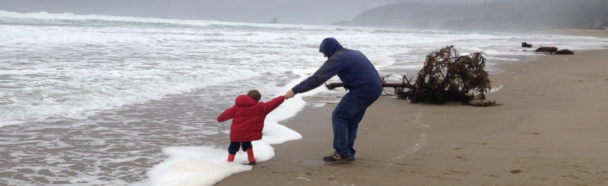

{ width=100% }

  

### Data science • Investment thoughts • Geeky miscellanea

---

This site is a window into my interests and work, which often coincide. Most of my remaining time is spent fruitfully with my wife and boy, with friends or with charities … or wasted by supporting sports teams that rarely win.

At work, I use data science to improve how asset owners select asset managers. I also chair the Investment Committee of the Society of Pension Professionals. Before that, I penned research papers on a wide range of investment subjects.

“But why p0bs?”, you may ask. Well, it began at school as a spoonerism of my name and got shortened to four letters. I then realised that it was better – and more available as a domain name – with ‘zero BS’!

---
